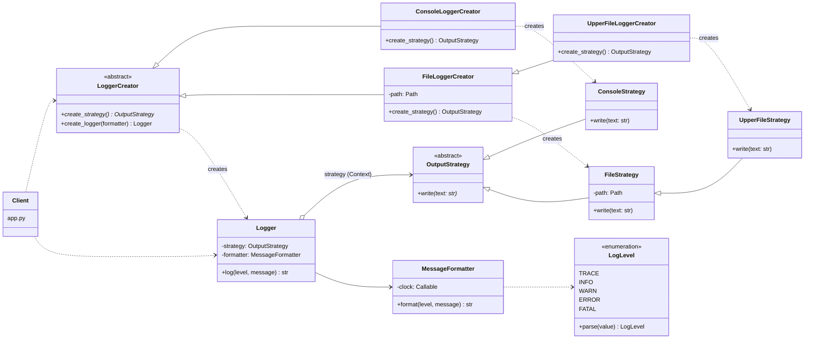

```mermaid
classDiagram
    direction LR

    class OutputStrategy {
        <<abstract>>
        +write(text: str)*
    }
    class ConsoleStrategy {
        +write(text: str)
    }
    class FileStrategy {
        -path: Path
        +write(text: str)
    }
    class UpperFileStrategy {
        +write(text: str)
    }

    class Logger {
        -strategy: OutputStrategy
        -formatter: MessageFormatter
        +log(level, message) str
    }
    class MessageFormatter {
        -clock: Callable
        +format(level, message) str
    }
    class LogLevel {
        <<enumeration>>
        TRACE
        INFO
        WARN
        ERROR
        FATAL
        +parse(value) LogLevel
    }

    class LoggerCreator {
        <<abstract>>
        +create_strategy()* OutputStrategy
        +create_logger(formatter) Logger
    }
    class ConsoleLoggerCreator {
        +create_strategy() OutputStrategy
    }
    class FileLoggerCreator {
        -path: Path
        +create_strategy() OutputStrategy
    }
    class UpperFileLoggerCreator {
        +create_strategy() OutputStrategy
    }

    class Client {
        app.py
    }

    %% Strategy
    OutputStrategy <|-- ConsoleStrategy
    OutputStrategy <|-- FileStrategy
    FileStrategy <|-- UpperFileStrategy
    Logger o--> OutputStrategy : strategy (Context)
    Logger --> MessageFormatter
    MessageFormatter ..> LogLevel

    %% Factory Method
    LoggerCreator <|-- ConsoleLoggerCreator
    LoggerCreator <|-- FileLoggerCreator
    FileLoggerCreator <|-- UpperFileLoggerCreator
    LoggerCreator ..> Logger : creates
    ConsoleLoggerCreator ..> ConsoleStrategy : creates
    FileLoggerCreator ..> FileStrategy : creates
    UpperFileLoggerCreator ..> UpperFileStrategy : creates

    Client ..> LoggerCreator
    Client ..> Logger
```
